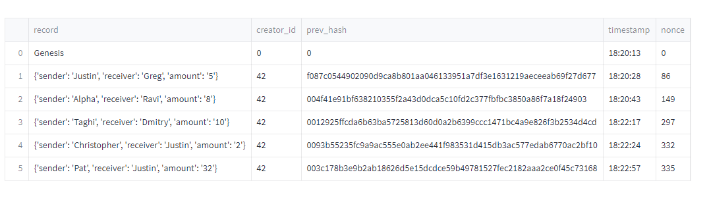

# Blockchain-Homework
---

## Summary:
>
This streamlit application was build to simulate transactions that would occur on a blockchain. In the interface, you can provide a sender, receiver, and an amount to send/receive and then add a block to show that the transaction took place. The transaction is then added to the ledger below and shows the record, previous hash, timestamp, and nonce that was used. There is also a validate chain button that checks to make sure the blockchain is valid and none of the previous blocks have been tampered with. This button will return "true" if the blockchain is indeed valid. Pictures can be seen below:

---
This shows the ledger that was created with 5 different transactions that I input:
>

---
This shows the entire webpage, with the validity check showing "true":
>

